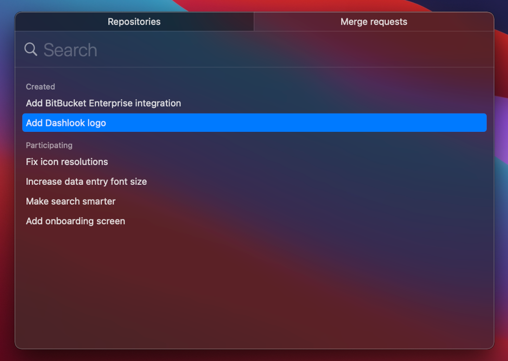
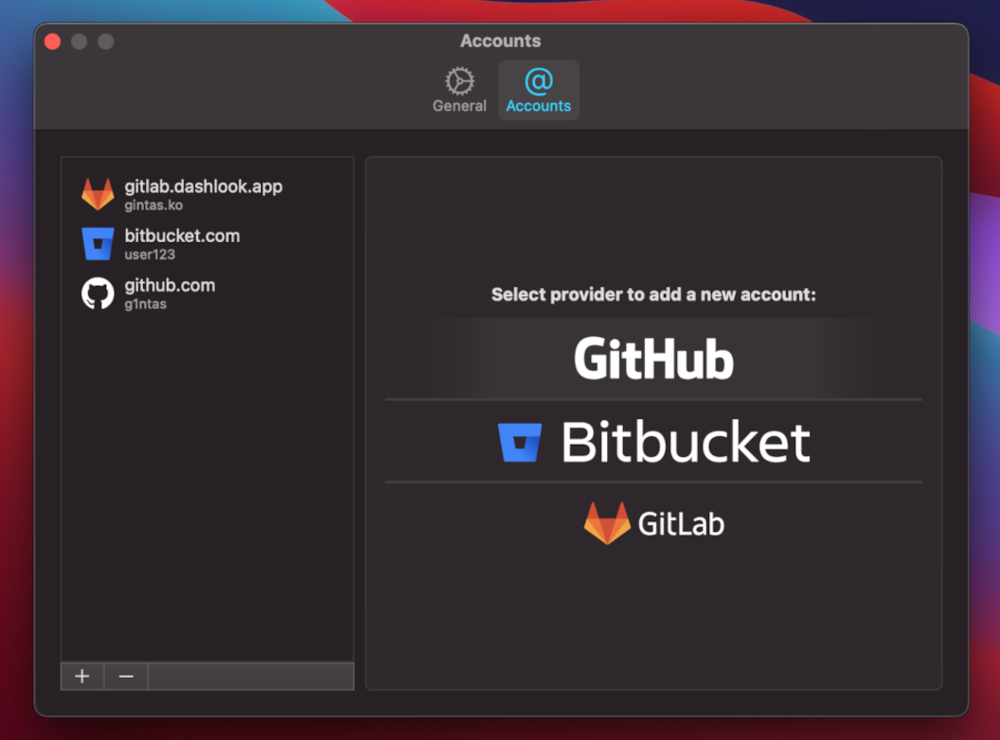
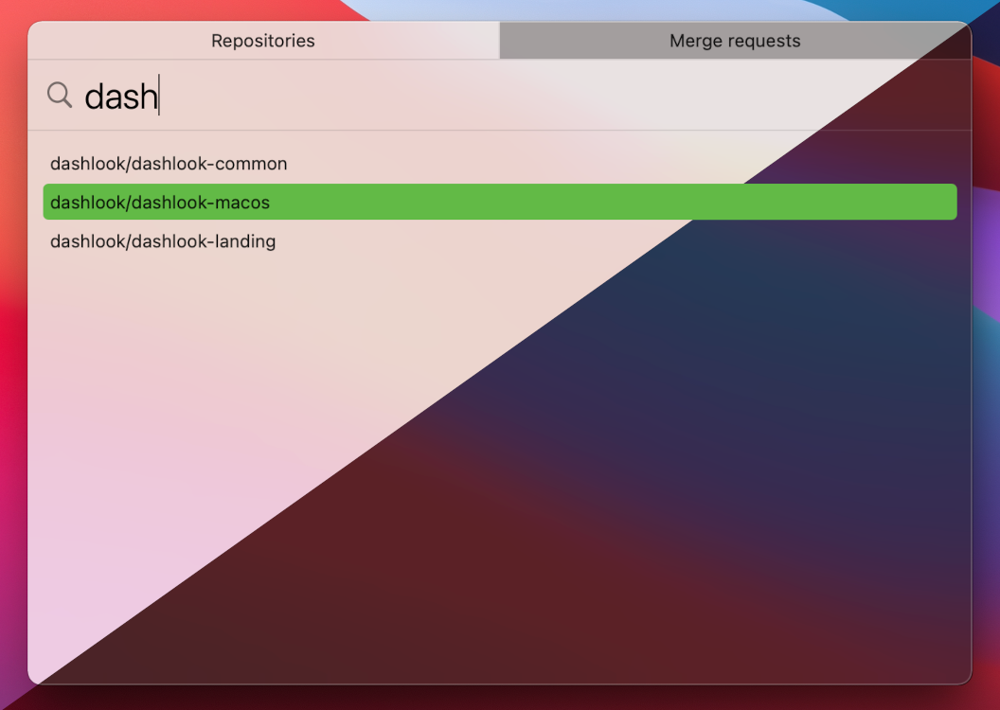

 

  
  <h3 align="center">Dashlook - Launcher for your Git workflow</h3>

  

    <strong>Official issue tracker for Dashlook application</strong>
     
    Mac app that lets you search your Git repositories with a few keystrokes without leaving your current window.
     
     
    <a href="https://dashlook.app">Download</a>
    ·
    <a href="https://github.com/dashlook/dashlook/issues">Report Bug</a>
    ·
    <a href="https://github.com/dashlook/dashlook/issues">Request Feature</a>
     
  

<h2 align="center">Features</h3>
<h3 align="center">Search and Launch</h3>

    

        Find your owned repositories and quickly open them in the browser for further action.
    

    

<h3 align="center">All in a single place </h3>

    

        Add your GitHub, BitBucket, or GitLab accounts (self-hosted and enterprise included). Have multiple? Add as much as you need. 
    

    

<h3 align="center">All in a single place </h3>

    

        Feel right at home with a natively built app that is lightweight and fast.
         
        Choose between light and dark, switch off transparency, or change accent colors - it's all inherited from your system preferences.
    

    

<h3 align="center">Start your free 30-day trial today</h3>

    <a href="https://dashlook.app" align="center">⚡️ Download ⚡️</a>

